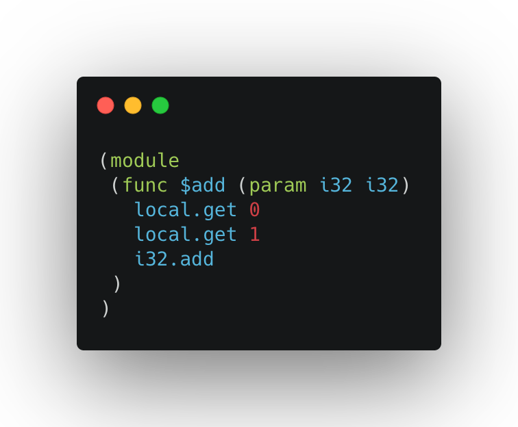

# Introducing WATI: WebAssembly Text Format Improved!


This is the first paragraph of my super cool article. In this article I will talk about many cool things that
have to do with programming

Lorem ipsum dolor sit amet, consectetur adipiscing elit. Sed etiam elementum id duis. Eu molestie vel
nulla eleifend donec pretium scelerisque gravida id. Dolor interdum morbi leo ullamcorper vel. Aliquam nam aliquam
in neque non. Risus eu eget dolor odio.

## What is WebAssembly anyway?

In this next example we get to see how the function `example` would work.
```js
function example() {
    console.log("Hello World!"); // see https://google.com
}
```
```html
<div id="hello!">content!</div>
```
```css
#hello {
    font-size: 2rem;
}
```
```wat
(module
    (func $x (param i32 i32) (result i32)
        local.get 0
    )
)
```
Pretty neat, huh?

Here's some of the code that drives this site:


I hope this looks good!

SUGGESTED|/articles/wati/[t]can there be low level programming on the web?|/articles/wati/[t]title of article?|/articles/wati/[t]another title

ISSUE|1