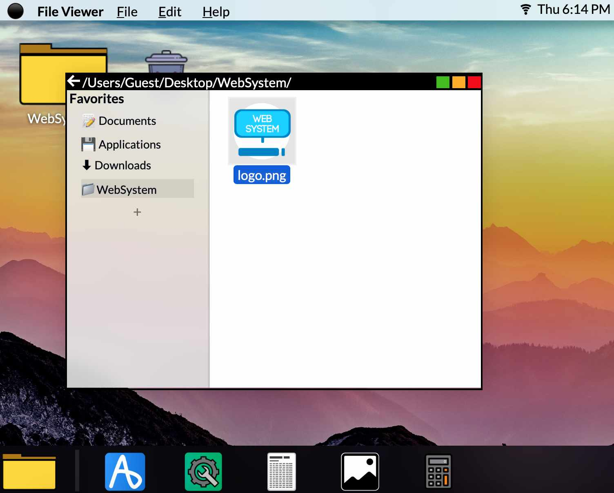

# What I Learned Writing an Operating System That Runs on The Web



Over the summer, I created a fully-fledged operating system written in vanilla JavaScript. Here's what I learned about the state of the web today.

NOTE: If you want to try out the OS for yourself, it's available online [here](https://websystem.natelev.in).

## Don't use framework-less JS for UI

The biggest thing I learned from this project was that vanilla JS is not remotely ideal for UI design. As you can imagine, needing to create hundreds of elements just to open a new window is annoying. All that exists to make complex UIs with JS is `document.createElement` (and Web Components, but I'll get to that later). This means that much of my code ended up looking pretty similar.

```js
const el = document.createElement("div");
el.style.foo = "...";
el.style.bar = "...";
parent.append(el);
```

All this is not to mention having to add event listeners to these elements and the many memory issues adding those event listeners causes. These memory issues constituted a significant portion to the high memory usage of WebSystem.

However, recently the various spec groups have come out with a pretty useful feature: [Web Components](https://www.webcomponents.org/introduction). Since I haven't gotten a chance to use them I won't go over them in this article, but I am sure that this could solve many of the problems I faced.

This is all to say that if you're looking to make a webapp, **use a front-end framework!** I certainly wasn't doing myself any favors trying to roll it on my own.

## Don't fear the backend

When I originally started WebSystem I only had experience writing front-end code. Since I didn't want to have to deal with any backend programming I decided I would store all user data on the client through LocalStorage.

As I got past the opening stages of development, I realized LocalStorage was way too limiting and slow for what I wanted to do. At this point, I had two options:

1. Write backend code that would store data in a proper database
2. Store all the data on the client and use IndexedDB

I should have known that just using a backend database would be much simpler, but I had such an irrational fear of backend that I chose to store this data on the client. When I implemented user sign in and began storing data on the server, I had multiple sources for the same information which caused countless errors.

## Use code splitting / Don't use classes when you don't need to

In WebSystem, I took an object-oriented approach to writing apps and system tools. For example, here's what an app might have looked like.

```js
class AppName {
    constructor() {
        this.window = new Window(...);
        ...
    }
    someFunc() {
        ...
    }
    someOtherFunc() {
        ...
    }
}
```

There are two problems with writing code this way.

The first problem is that there was no reason for this to be a class. In my code, when opening an app is equivalent to just instantiating a class and doing nothing with it. This is **not** how classes should be used. Use classes when there is a clear use of the class besides just that it feels right with the `new` operator.

The second problem is that this kind of class-based code is not testable. The way I wrote my code was so interdependent on other code I had written that I could not use unit or front end testing. In most cases I would have to manually check if something worked! This is why code splitting is important. If I had moved each method of the class into a separate function the code would be much more easily testable and readable.

## Bonus lessons!

-   Don't use `<script>` tags. Use ES modules! Handling dependencies is far easier with ES modules and it makes code much easier to read.
-   IndexedDB is awesome, but its actual API is terrible. Use [DexieJS](https://dexie.org) for a JS api or if you already know SQL use my DexieJS wrapper [JSQL](https://github.com/UltimatePro-Grammer/JSQL)
-   Use [Trello](https://trello.com) or a similar service to keep track of your progress and what you have left to do. Trello also works great in teams!

SUGGESTED|/articles/host-your-site-for-free-on-jamstack/[t]Host Your Site For Free On JAMstack

ISSUE|1

<!-- Compile with "npm run build-article src/articles/what-i-learned-writing-an-operating-system-that-runs-on-the-web/ -- --out src/articles/what-i-learned-writing-an-operating-system-that-runs-on-the-web/index.html" -->
