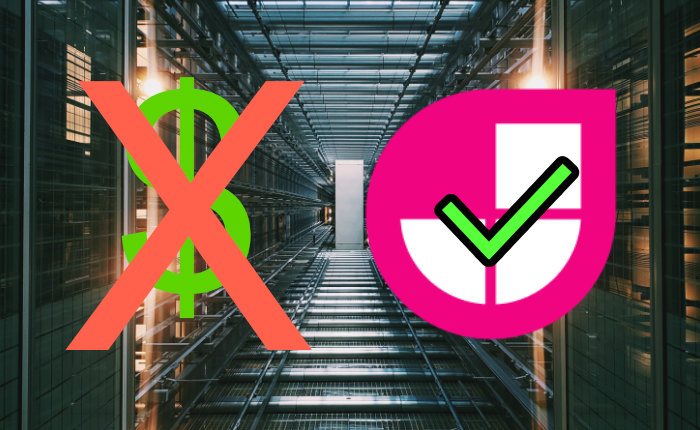

# Host Your Site For Free On JAMstack

Over the weekend, I switched this site
to a JAMstack hosting solution that is **completely free and scalable**.
I got it set up in less than half an hour and I'll never 
have to worry about traffic overloading my server!
In this article we'll go over my exact setup, so you
can host your very own site for absolutely free.

## Hosting your site

The first thing you will need to set up your site is a hosting provider.
Here's a quick overview of your options.

### [Github Pages](https://pages.github.com)
The hosting solution I chose for this site was [GitHub Pages](https://pages.github.com).
This is the best option if you already have your code open source
and available on GitHub.
It is super easy to integrate into an existing repository, and [the documentation](https://docs.github.com/en/free-pro-team@latest/github/working-with-github-pages/creating-a-github-pages-site#creating-your-site) is clear and helpful.

Once you've made a GitHub Pages website it will be auto-published under GitHub's `.github.io` domain. In order to use a custom domain, follow along with [this](https://docs.github.com/en/free-pro-team@latest/github/working-with-github-pages/managing-a-custom-domain-for-your-github-pages-site) tutorial.

### [Netlify](https://www.netlify.com)
Netlify is a great all-in-one solution for hosting a site for free.
For example, netlify supports builds out-of-the-box, while on GitHub Pages you have to set up a [deployment bot](https://github.com/marketplace/actions/deploy-to-github-pages).
Netlify also supports private repositories, which on GitHub Pages you will have to pay a fee for.
Netlify even includes 120k invocations of serverless functions for free!

## Adding backend functionality to your site with Serverless

"Serverless" is a bit of a buzzword these days, but it is a great option to add backend capabilities to your site for free.
Serverless functions are easy to write, and are built to scale well.

For this site I chose to use AWS Lambda, though some might find it easier to use Netlify or Google Cloud functions for their serverless needs.
Most of the serverless providers will give you enough invocations for free, so you should choose the one that works best for your particular use case.

I'm currently using serverless to allow people to message me through a web interface. If you want to try it, you can message me [here](https://natelev.in/contact/).

## Securing your site with [Cloudflare](https://www.cloudflare.com)

Many of the previously mentioned hosting options won't give you SSL support.
This [will lead to worse SEO](https://valveandmeter.com/ssl-seo-secure-website-impacts-search-traffic/) and will cause browsers to show your site as "not secure".

One easy way to fix this is to use [Cloudflare](https://www.cloudflare.com).
Cloudflare gives your site free SSL encryption (including auto-upgrading insecure connections to SSL) and your site gains free DDOS and down time protection, so your site will almost never go offline.

## Bonus - Where should I get my domain name?
If you want to be able to host your site on a custom domain you have to first buy a domain.
For free, there is really only one option: [Freenom](https://www.freenom.com/).
However, these domains won't be what you're probably thinking they will be.
The TLDs (the `.com` part of `example.com`) are very limited, and commonly associated with scam sites.

To get a domain with a `.com` or similar TLD you will need to pay for the domain.
I've found that [Namecheap](https://www.namecheap.com) is consistently the cheapest, though you should look around to see if the domain you want is available at other registrars for cheaper.

SUGGESTED|/articles/what-i-learned-writing-an-operating-system-that-runs-on-the-web/[t]What I Learned Writing an Operating System That Runs on The Web

ISSUE|2

<!-- Compile with "npm run build-article src/articles/host-your-site-for-free-on-jamstack/ -- --out src/articles/host-your-site-for-free-on-jamstack/index.html" -->