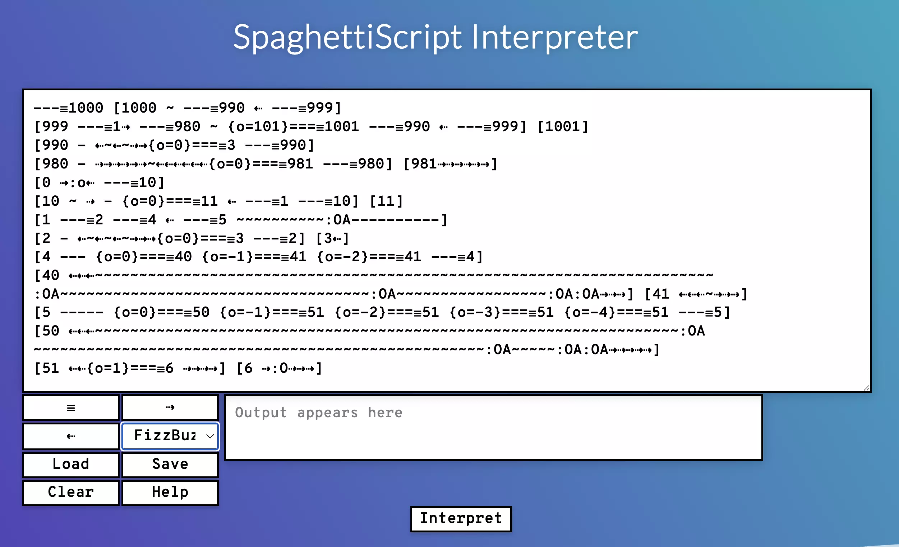

# SpaghettiScript: The Programming Language Where You Only Write Spaghetti Code



In May of 2020, stuck inside from the pandemic, I discovered the [esolangs.org](https://esolangs.org) wiki. I quickly found out about the underground world of **esoteric programming languages**, and I instantly fell in love.

I particularly took a liking to [BrainF---](https://esolangs.org/wiki/Brainfuck), in which the hello world code looks like this:

```
++++++++[>++++[>++>+++>+++>+<<<<-]>+>+>->>+[<]<-]>>.>---
.+++++++..+++.>>.<-.<.+++.------.--------.>>+.>++.
```

As you can tell, this is no ordinary programming language.

SUGGESTED|/articles/what-i-learned-writing-an-operating-system-that-runs-on-the-web/[t]What I Learned Writing an Operating System That Runs on The Web|/articles/host-your-site-for-free-on-jamstack/[t]Host Your Site For Free On JAMstack

ISSUE|3

<!-- Compile with "npm run build-article src/articles/spaghetti-script/ -- --out src/articles/spaghetti-script/index.html" -->
